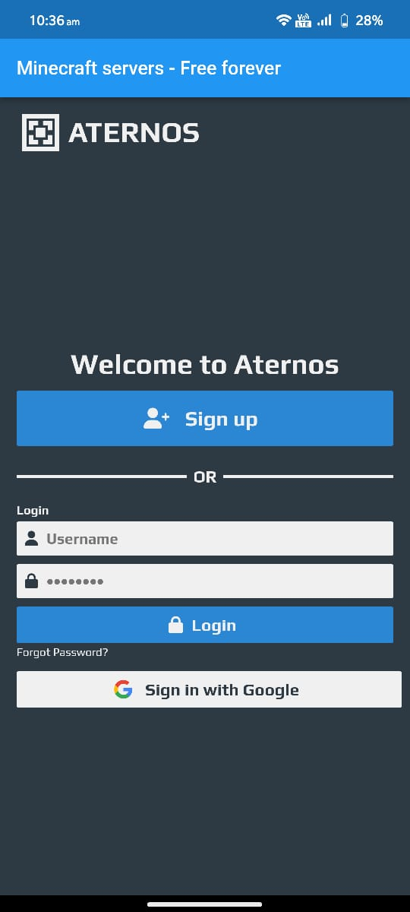
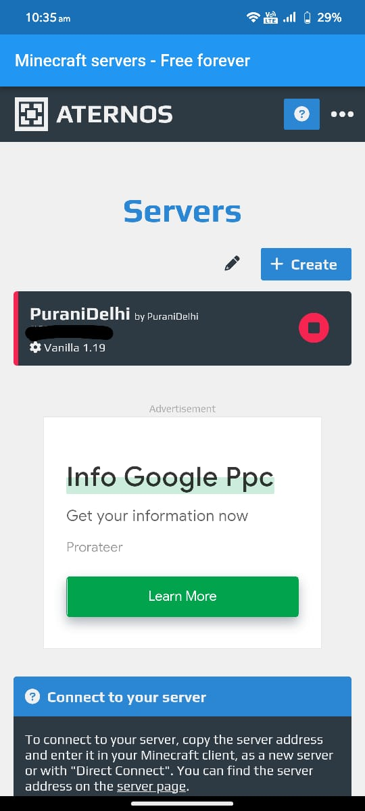
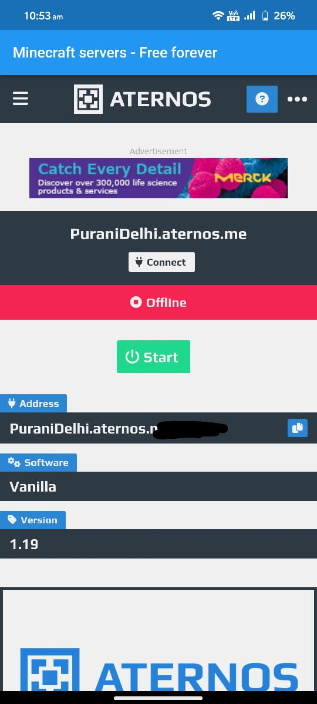
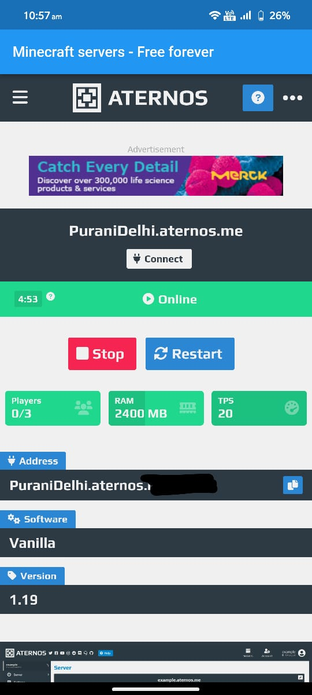

# AternosWebviewApp

## What is aternos?
Aternos is a free server provider for minecraft. It provide players a free realm for minecraft world where you can play with your friends. 
[click here to visit official site.](https://aternos.org/:en/)

## Application Preview

    
